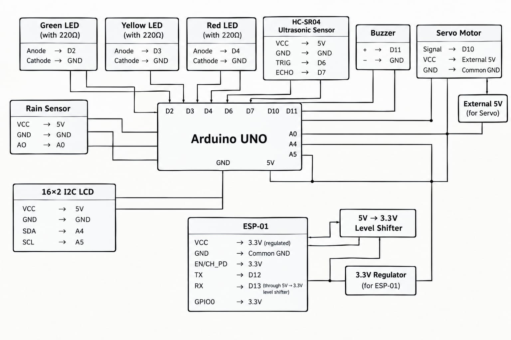
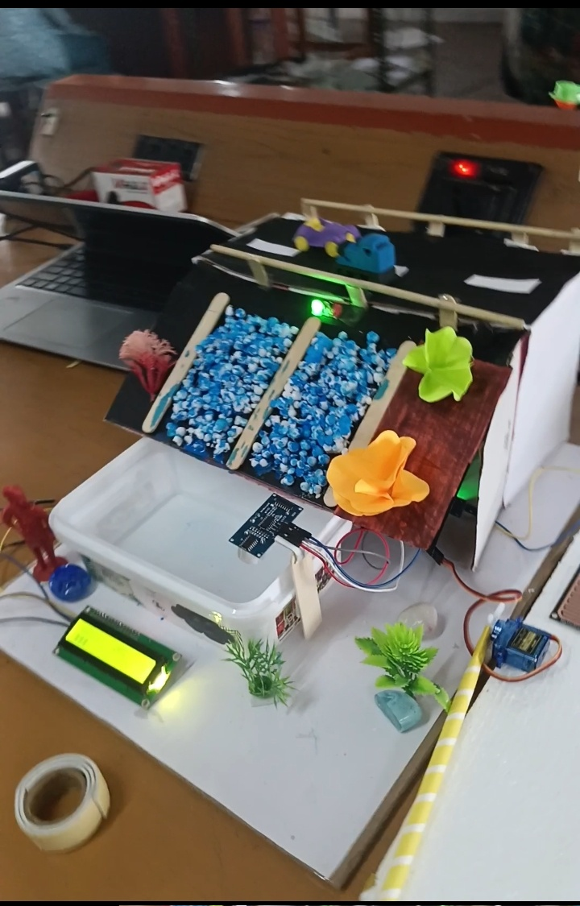

Smart Dam Water Management and Flood Early Warning System

1. Description

The Smart Dam Water Management and Flood Early Warning System is an IoT-based system designed to monitor the water level in a dam continuously. It uses sensors to detect rising water levels and automatically provides an early warning when the water reaches a dangerous level. This helps in better water management and reduces the risk of flood damage.

2. Problem Statement

Sudden increase in dam water level can cause flooding.

Manual monitoring may not provide warnings quickly.

Excess water may not be released at the right time.

People living near dams may not receive early warnings.

A low-cost, automatic monitoring system is needed.

3. Components

Arduino Uno/ESP32 – Main controller

Ultrasonic sensor – Measures water level

Water flow sensor – Measures water flow

Rain sensor – Detects rainfall

Buzzer – Gives emergency warning

LEDs – Shows water-level status

LCD/OLED display – Displays water level

Servo motor – Demonstrates automatic gate control

Power supply

Jumper wires and breadboard

4. Procedure

1. Place the ultrasonic sensor above the dam water surface.

2. Connect the sensors to the Arduino/ESP32.

3. Program the controller with different water-level limits.

4. Continuously measure the water level and flow.

5. Display the measured values on the LCD.

6. If the water level rises above the warning limit, activate the buzzer.

7. send alert with the help of buzzer.

8. At a critical level, demonstrate automatic opening of the dam gate using a servo motor.

5. Working

The ultrasonic sensor sends ultrasonic waves toward the water surface and measures the distance between the sensor and water. The controller converts this distance into the water level.

🟢 Normal level: System continues monitoring.

🟡 Warning level: LED/buzzer gives a warning.

🔴 Danger level: Emergency alarm is activated and an alert is sent to the responsible authority. The servo motor can be used to demonstrate opening of the dam gate.

The system continuously monitors the conditions and provides an early warning before the water reaches a critical level.

6. Advantages

Provides early flood warning.

Reduces the need for continuous manual monitoring.

Helps in efficient dam water management.

Provides real-time water-level information.

Can send alerts remotely.

Helps protect people and property near the dam.

Low-cost and suitable for prototype development.

Can be expanded using IoT and cloud monitoring.

7. Result

The proposed system successfully monitors dam water level, water flow, and rainfall conditions and provides warnings when the water level increases. It can help authorities take timely action, improve water management, and reduce the risk of flood-related damage.

schematic diagram:   

smart dam:  

